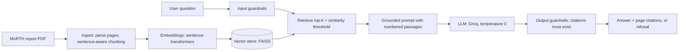

# RoadSafe RAG

A citation-grounded question-answering assistant over the Ministry of Road Transport and Highways (MoRTH) report *Road Accidents in India 2024*. Every answer is built only from retrieved passages, carries page-level citations, and is refused when the report does not support it.

> Built to demonstrate a production-style GenAI workflow end to end: ingestion, embeddings, vector search, guardrails, evaluation, an API, Docker and CI.

## Architecture



## What it does

| Capability | Where |
|---|---|
| PDF ingestion with page metadata, overlap-aware chunking | `ingest.py`, `chunking.py` |
| Embeddings (sentence-transformers) and exact vector search (FAISS, NumPy fallback) | `embeddings.py`, `vectorstore.py` |
| Grounded prompt, deterministic generation, retries | `rag.py`, `llm.py` |
| Guardrails: injection screen, length limit, similarity threshold, mandatory valid citations | `guardrails.py` |
| Evaluation: retrieval hit rate, MRR, answer check, refusal accuracy, latency | `evaluate.py` |
| REST API (FastAPI) with health check | `api.py` |
| Container and CI | `Dockerfile`, `.github/workflows/ci.yml` |
| Unit tests (31) that run offline, with no model download or API key | `tests/` |

## Quick start

```bash
python -m venv .venv
source .venv/bin/activate          # Windows: .venv\Scripts\activate
pip install -r requirements.txt
pip install -e .

python scripts/download_data.py    # saves the MoRTH PDF to data/raw/
python -m roadsafe_rag.ingest --pdf data/raw/road-accidents-in-india-2024.pdf

export GROQ_API_KEY=your-key       # Windows: set GROQ_API_KEY=your-key
uvicorn roadsafe_rag.api:app --reload
```

Without `GROQ_API_KEY` the service falls back to an extractive answerer (it quotes the top passage with a citation), so the whole pipeline still runs offline.

```bash
curl -X POST http://localhost:8000/ask \
  -H "Content-Type: application/json" \
  -d '{"question": "What are the main causes of road accidents?"}'
```

Response shape:

```json
{
  "answer": "... [1]",
  "citations": [{"id": 1, "source": "road-accidents-in-india-2024.pdf", "page": 42, "score": 0.61, "snippet": "..."}],
  "refused": false,
  "reason": null,
  "latency_ms": 840.2
}
```

When a question is out of scope, unsafe, or unsupported by the report, `refused` is `true` and `reason` explains why (`no_relevant_context`, `unsafe_input`, `uncited_answer`, `invalid_citation`, `model_declined`).

## Docker

```bash
docker build -t roadsafe-rag .
docker run -p 8000:8000 --env-file .env -v "$(pwd)/data/index:/app/data/index" roadsafe-rag
```

Build the index locally first (`ingest`); the container reads it from the mounted volume.

## Evaluation

1. Read the PDF and add 15-20 in-scope questions to `data/eval/golden_questions.jsonl` (format in `golden_questions.template.jsonl`). Record keywords that must appear in the answering passage.
2. Run:

```bash
python -m roadsafe_rag.evaluate
```

3. Paste the printed table below, with the date, model and settings used.

### Results

Both the default PyTorch embedder (`sentence-transformers`) and the lightweight ONNX embedder (`fastembed` used in Render deployment) were evaluated on the 21-question golden set with Groq LLM (`qwen/qwen3.8-27b`) and FAISS flat inner-product search (top_k=5, min_score=0.30):

| Metric | sentence-transformers (PyTorch) | fastembed (ONNX / Render) |
|---|---|---|
| Questions Evaluated | 21 | 21 |
| In-Scope Questions | 16 | 16 |
| Out-of-Scope Questions | 5 | 5 |
| Retrieval Hit Rate | **1.0 (100%)** | **1.0 (100%)** |
| Mean Reciprocal Rank (MRR) | **1.0** | **1.0** |
| Answer Keyword Rate | **0.812 (81.2%)** | **0.812 (81.2%)** |
| False Refusal Rate | **0.0 (0%)** | **0.0 (0%)** |
| Correct Refusal Rate (Adversarial / OOS) | **1.0 (100%)** | **1.0 (100%)** |
| Citation Rate When Answered | **1.0 (100%)** | **1.0 (100%)** |
| Average Latency (ms) | 6,256 ms | 6,226 ms |


## Design decisions

- **Refuse rather than guess.** A cosine-similarity threshold (`MIN_SCORE`) stops weak matches reaching the model, and the output check rejects any answer without a valid `[n]` citation. In a compliance or reporting setting a refusal is cheaper than a confident wrong number.
- **Exact (flat) search.** The corpus is one report, so brute-force inner product on normalised vectors is exact and fast. FAISS `IndexFlatIP` is used when available, with an identical NumPy fallback so CI needs no native dependencies.
- **Index/embedder consistency check.** The embedder name is stored with the index and verified at startup, which prevents the classic silent bug of querying with a different model than the one that built the index.
- **Provider-agnostic LLM interface.** `generate(system, user)` is the only contract, so swapping Groq for another provider is a one-class change.
- **Offline-testable.** A deterministic hashing embedder and an extractive LLM let the full pipeline run in unit tests and CI.

## Limitations

- PDF tables extract as noisy text, so numeric questions answered from tables can be weak. A table-aware parser is the biggest quality upgrade.
- Single-document corpus; no authentication or rate limiting on the API.
- The injection screen is pattern-based and is a first line of defence, not a complete one.
- Answers are only as good as the report; it is not an official MoRTH product.

## Roadmap

- Hybrid search (BM25 + dense) and a cross-encoder reranker
- Table-aware PDF parsing
- Request tracing and metrics (latency, refusal rate) with a dashboard
- Deploy to a cloud runtime (AWS or GCP) behind an API key

## Data source

*Road Accidents in India 2024*, Ministry of Road Transport and Highways, as published on [OpenCity](https://data.opencity.in). Check the dataset page for licence terms before redistributing the PDF; this repo does not include it.

## Run the tests

```bash
python -m unittest discover -s tests -t . -v
```

License: MIT
